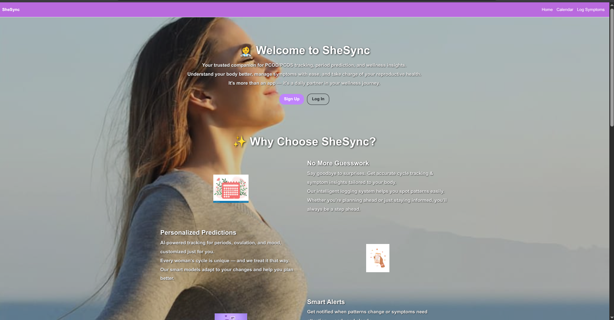
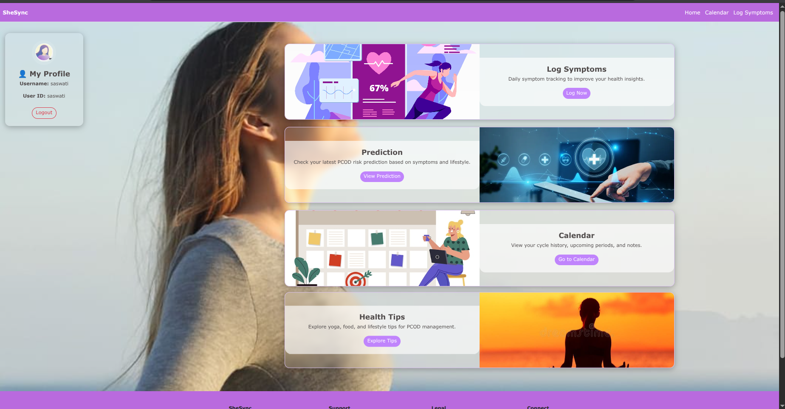
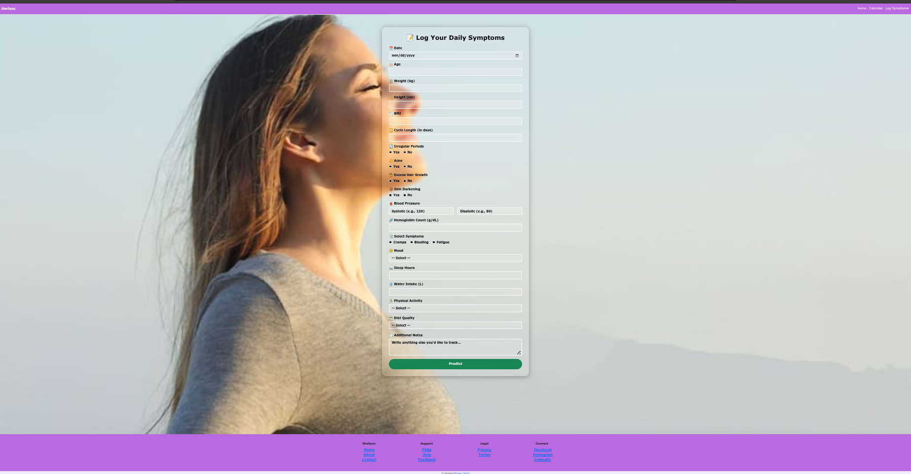
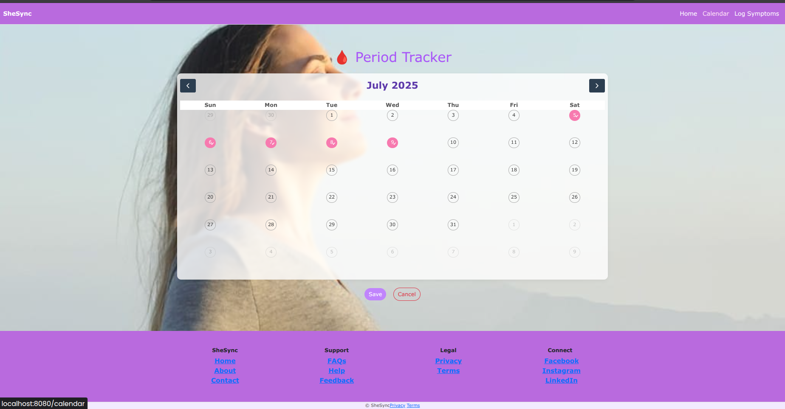
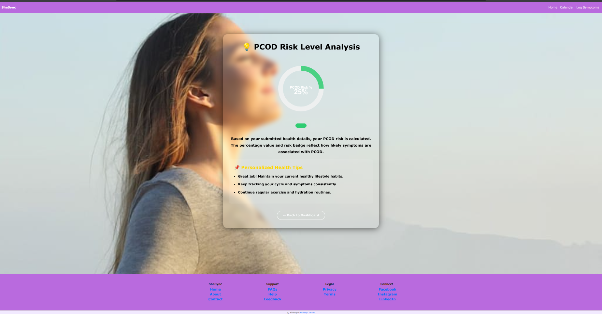
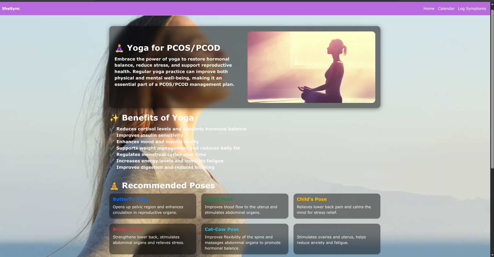
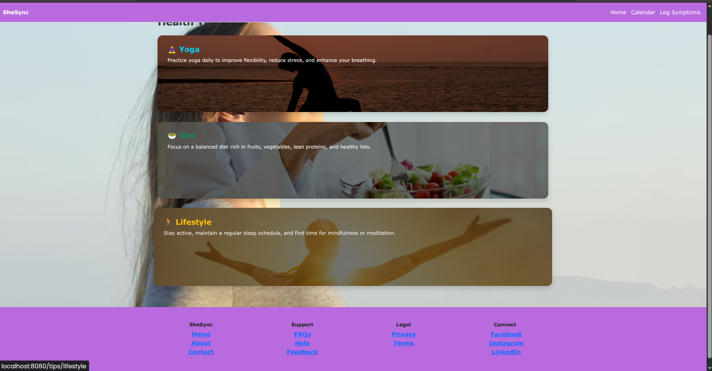

# PCOS/PCOD Tracker 💻🩺

This is a web-based application for tracking PCOS/PCOD symptoms and predicting conditions based on user input. Built with Node.js, Express, and Python ML integration.

---

## 📸 Screenshots

### 🏠 Home Page

### 📊 Dashboard

### 📝 Symptom Log

### 📅 Calendar

### 🔮 Prediction Result

### 🧘‍♀️ Yoga Suggestions

### 🏥 Healthcare Tips

